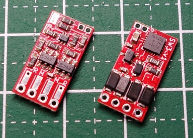

# SwitchDecoder3

NMRA DCC規格のアクセサリパケットを受信して、直流二線式のポイント線路を動作させることができるアクセサリデコーダです。

本リポジトリには、基板設計データとファームウェア、動作確認用ファームウェアが含まれています。

## 開発環境

- KiCad 6.0.8
- Microchip Studio Version 7.0.2542

## 主要スペック

  * 組み立て後の基板サイズ: 15.5mm x 8.0mm
  * 推奨最大電圧: 16V
  * 出力電流: 最大2A (ピーク3A)
  * マイコン書き込み端子を用意し、実装後のプログラム書き換えも可能
     UPDI 2pin Interface (GND / UPDI)

## 通常ファームウェア (Firmware)

設定したアクセサリアドレスに応じたDCCパケットを受信すると、ポイント線路を動作させます。

通電開始時にPROG端子に取り付けた配線をどちらかの線路に接触させることで、プログラムモードで起動します。

プログラムモードで起動している間に、同一のアクセサリアドレスに対する操作を連続して3回以上送信することで、設定されているアクセサリアドレスを送信したものに変更することができます。

また、CV値の書き込みにより、通電時間や通電開始までの遅延時間など、細かい動作の調整や、設定のリセットも可能です。

## 動作確認用ファームウェア (Firm_Test)

アクセサリアドレス「1」固定でDCCパケットを受信して動作できる機能と、PROG端子を線路に接触させると約1秒おきにポイント線路の転換動作を行うようにプログラムを作成してあります。

このファームウェアを書き込むことで、SwitchDecoder3基板のDCC入力、PROG端子、モータードライバ回路のすべてをテストすることができます。
  
## 各種ドキュメント

  * [マイコンのピンアサイン](docs/pin.md)
  * [パーツリスト](docs/partslist.md)
  * [CV値一覧](docs/cv_list.md)
  * [AVR Fuse Bitの設定内容](docs/avrfuse.md)